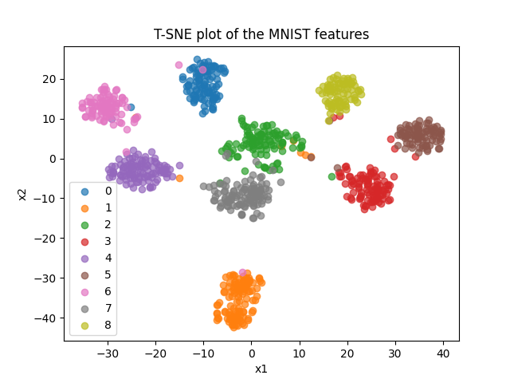
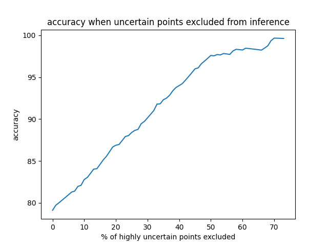
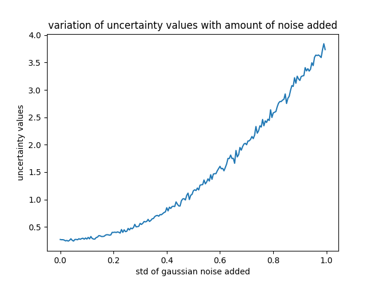
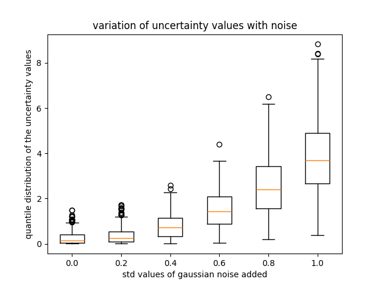
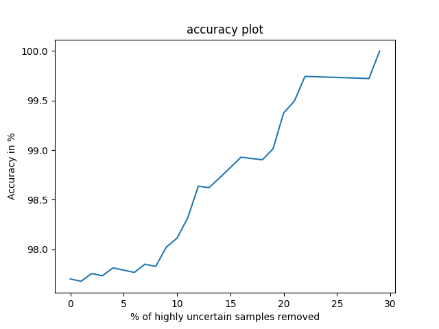
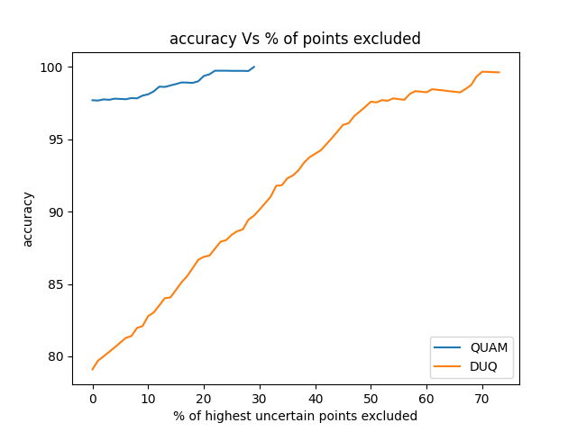

# Uncertainty Quantification And Benchmarking

## Author - Omkar Nitsure

The advent in Deep Learning through powerful network architectures, clever optimization techniques and large amounts of pre-training data has led to unprecedented accuracies for various tasks in Computer Vision, Natural Language Processing, and Automatic Speech Recognition. These results have led to the motivation to deploy these models to solve real-life problems. The main challenge in their deployment in critical applications is the unreliable and black box nature of their predictions. In this work, we examine and compare several approaches to quantify prediction uncertainty to make model predictions reliable, generalizable and robust to noise.

We further propose a standard benchmarking mechanism to compare different techniques for uncertainty quantification on a common scale.

Index Terms—Deep Learning, optimization, Uncertainty Quantification, evidential deep learning

## Introduction

Uncertainty in the predictions of Deep Learning models is a very active area of research in Machine Learning as it allows for commercial deployment of these models. These techniques will have applications in safety-critical areas like healthcare, self-driving vehicles, robotics, military and space exploration. By integrating Uncertainty Quantification (UQ) with model training as well as predictions, it is possible to quantify the level of confidence that the model has in its predictions and how much the predictions can be trusted. It also quantifies the amount of noise in the training or test data. This information will guide the improvements in data acquisition tools, further improving the model's accuracy.

Large deep-learning models require huge amounts of pretraining data and this data is often collected manually thus being prone to errors during acquisition. Some noise is also added by imperfect sensors. Usually, clean and accurate data is scarce and large models can easily overfit leading to lack of generalization to new data. In statistical terms, the data comes from an underlying distribution where the individual instances are samples. In practical applications, the test data used for evaluating the models might come from a different distribution than the training data. The lack of clean and static data is one of the sources of uncertainty that propagates till the final model predictions and thus needs to be addressed carefully. In such cases, it is desirable if the model rejects such test samples and does not provide any classification output. This is an example of Out of Distribution (OOD) detection.

Code is available at https://github.com/omkar-nitsure/UncertaintyQuantification-and-Benchmarking

## Sources Of Uncertainty

Various sources contribute to model prediction uncertainty.

It motivates researchers to aim to build a system that can flag warnings in such cases and make predictions only for samples where the confidence is above a certain threshold and give uncertain samples to humans for prediction.

Various sources of uncertainty can be classified into the following 2 types -

## A. Aleatoric Uncertainty

Aleatoric Uncertainty [1] is defined as the uncertainty arising from the inherent randomness of an event (stochastic relationship between input and output variables *V ar*(Y ∥x)).

Usually, even though the mapping from X to Y is deterministic to some extent, it is theoretically more advantageous to consider it as a stochastic process and admit that Y cannot be predicted from X without error. More data might not be able to reduce this kind of uncertainty while information rich data samples can help in this regard. True data might have some additional features (Z) other than the ones which were acquired (X) and they can help predict the output (Y )
with much less uncertainty. Labels can also be noisy (wrong labelling) leading to models with inherent bias.

Model optimization can sometimes increase the robustness of models to errors in data. For large models, parameter optimization using gradient descent ensures that more error-prone features of the training data (X) have much less influence over model prediction than the other cleaner features.

## B. Epistemic Uncertainty

Epistemic Uncertainty [1] arises due to a lack of knowledge. Every model architecture can express a set of function space which is searched through during gradient descent to find the parameters which lead to the minimum loss. Even if the data distribution lies in this function space, optimal parameters cannot be learned because of noise. This is called the Epistemic Uncertainty. In most practical cases, the data distribution doesn't even belong to the function space of the architecture making it impossible to learn the distribution and generalize to unseen data. This inability of the model arises because of constraints on the number of learnable parameters.

This type of uncertainty can be reduced by adding more data as it helps the model learn more patterns and generalize well to different distributions. So spending resources to acquire more data usually helps in case model is struggling with making decisions.

SoftMax and cross-entropy pair in terms of accuracy and still give good uncertainty performance.

## Methods

This section discusses some standard methods used to quantify uncertainty. Different methods can be classified into 2 categories namely Bayesian methods and Non-bayesian methods based on the methods of sampling model parameters. The description of each of the methods is given below -

## A. Bayesian Methods

In machine learning, Gradient Descent is used to learn the *right* weights of neural networks and they are used during inference. In Bayesian methods, weights are sampled from a predetermined distribution (like Gaussian) and the parameters of those distributions are learned during gradient descent. During inference, samples are drawn from the learned weight distributions and multiple forward passes are done for a test example, each time sampling new weight instances from the distributions. All corresponding model outputs are then computed and their variance is examined. If the outputs are similar then confidence in the prediction is high and if they are different, then prediction uncertainty is high.

Some popular methods in this category are the Monte Carlo Dropout [2] and Variational Inference [3] in Graphical Neural Networks.

## B. Non-Bayesian Methods

Non-Bayesian methods are also called Frequentist Methods as they involve training completely disjoint models in parallel.

These models have different weight initializations, hyperparameters and sometimes even different model architectures and training data. During inference, the same test input is given to all the models in parallel and the outputs are compared. If the outputs of these models (which generally have similar training loss) are similar then the prediction is confident else the model is uncertain. If the model is confident, then the output can be the mean of the outputs of the ensemble.

One of the drawbacks of this method is the large amount of compute required both for training and inference. It also requires a large amount of memory to load all models in parallel. Some popular methods in this category are Ensemble Learning [4] and Bootstrap [5].

In most classification tasks, the final layer uses SoftMax activation to give the probability of an example belonging to different possible classes. The sample is assigned that label which has the largest probability value. During training, Cross Entropy loss penalizes high probability values assigned to the wrong classes. This training approach can potentially lead to very confident but wrong predictions as minimizing crossentropy loss encourages low-entropy probability distributions at the output. Thus, even if the model is unsure about its prediction, it tends to output a very high probability value for one class which is why it sometimes makes the wrong prediction with confidence. Researchers are thus looking for novel loss functions and activations which can compete with

## Current Research Ideas 
## A. Evidential Deep Learning

Evidential Deep Learning [6] tries to overcome the disadvantages of SoftMax activation for the final output layer of the neural network. Evidential deep learning defines a different output layer for the neural networks. It defines an evidential prior based on the amount of evidence available from a particular input for each of the classes and trains the model to *collect* more evidence for the correct class as opposed to other incorrect classes.

If the focus is only on the classification tasks, then by employing Evidential deep learning, we train the model to output parameters of a Dirichlet distribution. So, given an input sample, the neural network outputs values of parameters of a Dirichlet distribution. The model prediction and uncertainty are then computed using standard formulae involving the parameter values. In this way, there is no need for the crossentropy loss and SoftMax activation, which ensures reliable and robust predictions. This approach might sometimes reduce the model prediction accuracy, but that is a trade-off for much better uncertainty quantification.

## B. Distance-Aware Neural Networks

Modern Neural Networks extract rich information from an input sample in terms of a vectorized representation, but these representations are usually not distance-aware [7]. In these techniques, the model is trained to output distance-aware representations. The training data distribution is usually just a subset of the overall data-generating distribution, but we want the model to generalize well to the unseen OOD data as well. Thus, the model should be able to recognize whether the test point belongs to the training data manifold or not. This can be achieved by imposing a L2 Lipschitz constraint during training, which ensures that the distance between 2 points in the representation space is proportional to the distance between them in the input space (inputs belonging to different classes should have distant representations). This allows us to restrict decision-making to only the In distribution (ID) points.

## C. Deterministic Uncertainty Quantification

In classification tasks, the neural networks usually consist of 2 parts - 1) Feature extractor 2) Output probability distribution projector. Neural network create a representation for every input and then map this representation to one of the class labels. Thus, these representation clusters must be distant for different classes. Deterministic Uncertainty Quantification [8]
(DUQ) exploits this idea to estimate the uncertainty of a particular example.

It defines a kernel value per class, which is defined as -

$$K_{c}(f_{\theta}(x),e_{c})=\exp[-\frac{\frac{1}{n}||W_{c}f_{\theta}(x)-e_{c}||_{2}^{2}}{2\sigma^{2}}]$$

The training process tries to maximize the kernel value for the correct class and minimize it for all the wrong classes. The training objective and loss-function are as follows -

$$
\arg\max_{c} K_{c}(f_{\theta}(x), e_{c})
$$

$$
L(x, y) = -\sum_{c} y_{c} \log(K_{c}) + (1 - y_{c}) \log(1 - K_{c})
$$

It ensures that the cluster centers are separated in the higher dimensional space. Cluster centers are computed again after each iteration. Uncertainty is the minimum of all kernel values.

If this value is small, then it means that the input example belongs to that class, but if this value is large, then it means that the input doesn't belong to any of the classes and can be either an OOD example or the model is uncertain about its prediction.

## D. Quantification Of Uncertainty With Adversarial Models

This approach uses the idea of training different models in parallel and defining uncertainty as the variance of their prediction. Uncertainty Quantification with Adversarial Models [9] (QUAM) has an additional criterion that the models must fulfil. This method starts with a base model trained on the task at hand where we can make use of large amounts of pre-training data using Self Supervised Learning (SSL).

K different models are then trained per test sample during inference starting from the same base model where each model should have output probability distribution centred around some randomly picked class while maintaining similar loss on the training data. The optimization objective is -

$$
\text{max}_{\delta \in \Delta} \left( D\left(p(y \mid x, w), p(y \mid x, w + \delta)\right) + c \left( \log p(w + \delta \mid D) - \log p(w \mid D) + \gamma \right) \right)
$$

Here, D is usually the Kullback-Leibler (KL) divergence.

Finally, the outputs of K finetuned models are computed.

Uncertainty is the variance of the K predictions. This method is computationally expensive as it finetunes K different models for each test example, but the uncertainty value reported by this method is very accurate (better than all other methods).

It justifies the time, space and computing required if it is deployed for a safety-critical application.

## Setup, Model And Datasets

The setup used for doing all experiments is as follows - - Training data - 10000 randomly sampled images from train split of MNIST dataset
- Base classification model - LeNet (No of trainable parameters - 60k) - In distribution (ID) test examples - 1000 randomly sampled images from test split of MNIST
- Out-of-distribution (OOD) examples - 500 images of digits other than MNIST + 1000 images from Imagenet

## A. Results Of Experiments On Duq

LeNet model was trained on the MNIST dataset for 100

epochs. The plot depicts the T-SNE visualization of the features extracted by the feature extractor before the final classification layer -

Fig. 1. Feature Clusters for the various classes
Training was robust and loss reduced uniformly but the

model accuracy is a bit lower than the standard SoftMax-based models. A point to note is that the uncertainty quantification scores are very good. The average uncertainty score for ID
examples is 14.27 while for OOD examples is 24313.89. The following plot shows accuracy of the model after rejecting test samples with uncertainty value above a certain threshold
(tested on the MNIST dataset) during inference -

Fig. 2. accuracy Vs % of highly uncertaint points rejected for DUQ

## B. Effects Of Noise Addition

Zero-mean white gaussian noise with increasing variance was added to randomly selected images during inference and then the average uncertainty value was reported. The average value of uncertainty increased as can be seen in the following figure. This analysis can be used in another context. The technique of progressively adding more and more noise to the data and observing the uncertainty value trend can be used

for benchmarking a method against state-of-the-art (SOTA)
methods.

Fig. 3. Average uncertainty value for different noise variance
The following figure shows the distribution of uncertainty

values with varying noise variance. We can conclude that the variance in the uncertainty values grows with variance of the added noise.

Fig. 4. Distribution of Uncertainty values for noise values

## C. Results Of Experiments On Quam

This method can exploit model pre-training and thus gives very good classification accuracy while doing excellent uncertainty quantification. Uncertainty values are computed as the entropy of the output distribution. Average uncertainty values for different image types are as follows -
- ID images(MNIST) - 0.232
- OOD but the same classes(Digits) - 0.456
- OOD and different classes - 2.251 The following plot shows accuracy of the model after rejecting test samples with uncertainty value above a certain threshold during inference -

Fig. 5. accuracy Vs % of highly uncertaint points rejected for QUAM

The following plot shows accuracy curves for both DUQ

and QUAM on the same plot. We propose area under this curve (AUC) as one of the benchmarks to compare the quality of 2 different uncertainty quantification techniques. The AUC values for DUQ and QUAM are 6773.83 and 7361.92, respectively demonstrating that QUAM is a better technique than DUQ for uncertainty quantification.

Fig. 6. AUC curve for both DUQ and QUAM

## Conclusions

Uncertainty Quantification is a new and heavily researched topic in modern Machine Learning because the motivation of most of the research is to improve the prediction accuracy and reliability so it can be deployed in real life. The prediction accuracy falls after deployment as the input it receives is generally different from the training data and causes the model to be uncertain about its prediction. The sources of this uncertainty are noise in input data, distribution shift of the test data from the training data, adversarial attacks [10] of different kinds, smaller model size and thus inability to generalize to a broader range of input types, inability of the model to detect a test example as OOD (coming from a distribution that the model has not seen during training).

Modern Deep Learning models are trained with at least some technique to mitigate the uncertainty in prediction or quantify the amount of uncertainty. Adversarial attacks are aimed to exploit the vulnerabilities in model prediction and thus being heavily used in modern machine learning research for uncertainty quantification. We examined various SOTA
techniques for uncertainty quantification and also proposed some benchmarks like comparing the accuracy curve after removing data samples above a certain threshold of uncertainty and the area under this curve. These benchmarks can be used to compare different techniques for uncertainty quantification on an objective scale.

## References

[1] C. Gruber, P. O. Schenk, M. Schierholz, F. Kreuter, and G. Kauermann,
"Sources of uncertainty in machine learning–a statisticians' view," arXiv preprint arXiv:2305.16703, 2023.

[2] Y. Gal and Z. Ghahramani, "Dropout as a bayesian approximation:
Representing model uncertainty in deep learning," in *international* conference on machine learning, pp. 1050–1059, PMLR, 2016.

[3] D. P. Kingma and M. Welling, "Auto-encoding variational bayes," *arXiv* preprint arXiv:1312.6114, 2013.

[4] L. Breiman, "Bagging predictors," *Machine learning*, vol. 24, pp. 123–
140, 1996.

[5] B. Efron, *The jackknife, the bootstrap and other resampling plans*.

SIAM, 1982.

[6] M. Sensoy, L. Kaplan, and M. Kandemir, "Evidential deep learning to quantify classification uncertainty," *Advances in neural information* processing systems, vol. 31, 2018.

[7] J. Liu, Z. Lin, S. Padhy, D. Tran, T. Bedrax Weiss, and B. Lakshminarayanan, "Simple and principled uncertainty estimation with deterministic deep learning via distance awareness," Advances in neural information processing systems, vol. 33, pp. 7498–7512, 2020.

[8] J. van Amersfoort, L. Smith, Y. W. Teh, and Y. Gal, "Uncertainty estimation using a single deep deterministic neural network," 2020.

[9] K. Schweighofer, L. Aichberger, M. Ielanskyi, G. Klambauer, and S. Hochreiter, "Quantification of uncertainty with adversarial models,"
Advances in Neural Information Processing Systems, vol. 36, 2024.

[10] I. Alarab and S. Prakoonwit, "Adversarial attack for uncertainty estimation: identifying critical regions in neural networks," Neural Processing Letters, vol. 54, no. 3, pp. 1805–1821, 2022.